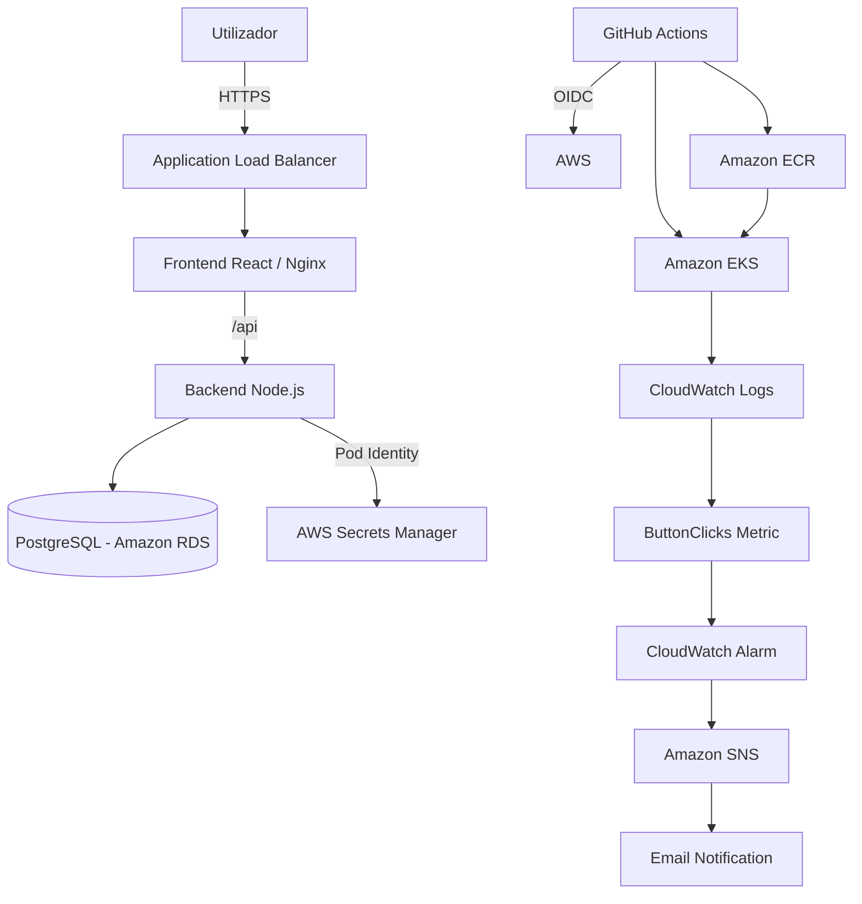

# Junior Full Stack Challenge — AWS & DevOps

Aplicação Full Stack desenvolvida em React, Node.js e PostgreSQL, com infraestrutura AWS criada através de Terraform, deployment em Amazon EKS, pipeline CI/CD com GitHub Actions, HTTPS, observabilidade com CloudWatch e gestão segura de secrets.

O objetivo principal da solução foi manter a arquitetura simples, reproduzível e fácil de compreender, sem adicionar componentes desnecessários.

---

## Arquitetura



### Fluxo principal

1. O utilizador acede à aplicação através de HTTPS.
2. O Application Load Balancer encaminha o pedido para o frontend.
3. O frontend React é servido por Nginx.
4. Ao clicar em **Obter mensagem**, o frontend chama a API Node.js.
5. A API obtém a mensagem armazenada no PostgreSQL.
6. A mensagem é devolvida ao frontend e apresentada no ecrã.
7. Cada clique gera um evento `button_click`.
8. Os logs são enviados para o CloudWatch.
9. Um Metric Filter transforma os eventos numa métrica `ButtonClicks`.
10. Se forem registados pelo menos 5 cliques num período de 60 segundos, o CloudWatch Alarm é ativado e envia uma notificação através do SNS.

---

## Tecnologias

### Aplicação

- React
- TypeScript
- Node.js
- Express
- PostgreSQL
- Nginx

### Containers e Kubernetes

- Docker
- Docker Compose
- Amazon ECR
- Amazon EKS
- Kubernetes

### Infraestrutura e AWS

- Terraform
- Amazon VPC
- Amazon EKS
- Amazon RDS
- Amazon ECR
- Application Load Balancer
- AWS Secrets Manager
- Amazon CloudWatch
- Amazon SNS
- AWS IAM
- EKS Pod Identity

### CI/CD

- GitHub Actions
- GitHub OIDC

---

## Estrutura do projeto

```text
junior-fullstack-challenge/
│
├── backend/
│   ├── src/
│   ├── Dockerfile
│   └── package.json
│
├── frontend/
│   ├── src/
│   ├── Dockerfile
│   ├── nginx.conf
│   └── package.json
│
├── database/
│   └── init.sql
│
├── kubernetes/
│   ├── backend.yaml
│   └── frontend.yaml
│
├── terraform/
│   ├── network.tf
│   ├── eks.tf
│   ├── database.tf
│   ├── ecr.tf
│   ├── backend-iam.tf
│   ├── github-actions.tf
│   ├── load-balancer.tf
│   ├── cloudwatch.tf
│   ├── alerts.tf
│   ├── providers.tf
│   ├── variables.tf
│   ├── versions.tf
│   └── outputs.tf
│
├── .github/
│   └── workflows/
│       └── ci-cd.yml
│
├── docker-compose.yml
├── .env.example
├── .gitignore
└── README.md
```

---

# Executar localmente

## Pré-requisitos

Para executar a aplicação localmente é necessário:

- Git
- Docker
- Docker Compose

Clonar o repositório:

```bash
git clone <repository-url>
cd junior-fullstack-challenge
```

Criar o ficheiro local de configuração a partir do exemplo.

### PowerShell

```powershell
Copy-Item .env.example .env
```

### Linux / macOS

```bash
cp .env.example .env
```

O ficheiro `.env` não é versionado pelo Git.

Depois executar:

```bash
docker compose up --build
```

A aplicação fica disponível em:

```text
http://localhost:8080
```

A API fica disponível em:

```text
http://localhost:3000
```

Health check:

```text
http://localhost:3000/health
```

Ao clicar em **Obter mensagem**, deverá aparecer:

```text
Hello from PostgreSQL!
```

No ambiente local, frontend, backend e PostgreSQL são executados através de containers Docker.

---

# Testes

## Backend

```bash
cd backend
npm ci
npm test
```

## Frontend

```bash
cd frontend
npm ci
npm test
npm run build
```

Os mesmos testes são executados automaticamente pelo pipeline de CI/CD.

---

# Infraestrutura AWS

Toda a infraestrutura da aplicação é definida através de Terraform.

## Pré-requisitos

- Terraform >= 1.5
- AWS CLI
- kubectl
- Docker
- Uma identidade AWS autenticada com permissões suficientes para criar a infraestrutura

A região utilizada pelo projeto é:

```text
eu-south-2
```

A região pode necessitar de estar ativada na conta AWS antes do deployment.

O operador utilizado para executar Terraform é considerado uma identidade de bootstrap e não faz parte da infraestrutura runtime da aplicação.

---

## Configurar autenticação AWS

Exemplo utilizando um AWS CLI profile:

```powershell
$env:AWS_PROFILE="terraform-local"
```

Confirmar a identidade:

```bash
aws sts get-caller-identity
```

---

## Configurar email dos alertas

O endereço de email não é guardado no repositório.

### PowerShell

```powershell
$env:TF_VAR_notification_email="email@example.com"
```

### Linux / macOS

```bash
export TF_VAR_notification_email="email@example.com"
```

---

## Criar a infraestrutura

```bash
cd terraform
terraform init
terraform fmt -check
terraform validate
terraform plan
terraform apply
```

O Terraform cria, entre outros:

- VPC e subnets
- Amazon EKS
- Worker node
- Amazon ECR
- Amazon RDS PostgreSQL
- AWS Secrets Manager
- IAM Roles e Pod Identity
- Application Load Balancer
- Certificado TLS para demonstração
- CloudWatch Observability
- CloudWatch Logs
- Metric Filter
- CloudWatch Alarm
- Amazon SNS
- Role OIDC para GitHub Actions

Depois da criação do SNS, o endereço configurado recebe um email da AWS que deve ser confirmado para ativar as notificações.

---

# Kubernetes

A API é configurada com:

```text
2 réplicas
```

O backend inclui:

- readiness probe
- liveness probe
- ServiceAccount próprio
- EKS Pod Identity
- acesso ao secret da base de dados

O frontend inclui:

- readiness probe
- liveness probe
- Nginx
- Service Kubernetes

Os manifests Kubernetes funcionam como templates.

Valores específicos do ambiente, como:

```text
imagem ECR
endpoint RDS
ARN do secret
```

não ficam hardcoded nos manifests.

O GitHub Actions consulta esses valores diretamente na AWS e renderiza os manifests antes do deployment.

---

# CI/CD

O workflow encontra-se em:

```text
.github/workflows/ci-cd.yml
```

Um push para a branch `main` executa:

```text
Backend tests ──────┐
                    ├──> Build Docker images
Frontend tests ─────┘
                            │
                            ▼
                       Push para ECR
                            │
                            ▼
                Resolver valores AWS
                            │
                            ▼
                 Render Kubernetes YAML
                            │
                            ▼
                       Deploy backend
                            │
                            ▼
                       Deploy frontend
```

A autenticação AWS do GitHub Actions utiliza **OIDC**.

Não são guardadas AWS Access Keys no GitHub.

A trust policy da role está limitada ao repositório e à branch `main`.

As permissões permitem apenas as operações necessárias para:

- publicar imagens nos dois repositórios ECR;
- consultar o cluster EKS;
- consultar os dados necessários da instância RDS;
- realizar deployment no namespace Kubernetes `default`.

---

# Deployment em ambiente com recursos limitados

O ambiente do desafio utiliza apenas um worker node para reduzir o consumo de recursos.

Durante os testes foi identificado que o node tem um limite reduzido de Pods e que um rolling update tradicional poderia tentar criar Pods adicionais temporariamente.

Por esse motivo, os Deployments utilizam:

```yaml
strategy:
  type: RollingUpdate
  rollingUpdate:
    maxSurge: 0
    maxUnavailable: 1
```

O pipeline também atualiza os workloads sequencialmente:

```text
Backend
   ↓
aguardar rollout
   ↓
Frontend
   ↓
aguardar rollout
```

Isto evita competição pelos slots disponíveis no node.

No backend existem duas réplicas, pelo que uma réplica pode continuar disponível enquanto a outra é atualizada.

No frontend existe apenas uma réplica neste ambiente de demonstração, pelo que pode ocorrer uma pequena indisponibilidade durante o deployment.

Numa solução de produção seriam utilizados múltiplos worker nodes, autoscaling e capacidade adicional para permitir rolling updates sem indisponibilidade.

---

# Base de dados

Em ambiente AWS é utilizado:

```text
Amazon RDS for PostgreSQL
```

A base de dados:

- encontra-se em subnets privadas;
- não é publicamente acessível;
- utiliza storage encriptado;
- apenas aceita PostgreSQL a partir dos recursos EKS autorizados.

A password principal é gerida pela AWS e armazenada no AWS Secrets Manager.

O backend não recebe a password através de ficheiros ou Kubernetes Secrets estáticos.

---

# Secrets e Pod Identity

O backend utiliza **EKS Pod Identity**.

Fluxo:

```text
Backend Pod
    ↓
ServiceAccount backend
    ↓
EKS Pod Identity
    ↓
IAM Role
    ↓
secretsmanager:GetSecretValue
    ↓
Secret específico da base de dados
```

A role do backend pode executar apenas:

```text
secretsmanager:GetSecretValue
```

sobre o secret necessário para a base de dados.

Não existem passwords, tokens ou AWS Access Keys no código.

---

# HTTPS e TLS

O acesso público à aplicação é feito através de um Application Load Balancer.

Pedidos HTTP são redirecionados para HTTPS.

Para o ambiente do desafio é utilizado um certificado self-signed importado no AWS Certificate Manager.

Por esse motivo, o browser pode apresentar um aviso de confiança no certificado.

A ligação continua a utilizar TLS, mas o certificado não foi emitido por uma Certificate Authority pública.

## Solução de produção

Numa solução de produção seria utilizado:

1. um domínio, por exemplo:

```text
app.example.com
```

2. um certificado público emitido pelo AWS Certificate Manager;

3. validação DNS do certificado;

4. um registo DNS Alias apontado para o Application Load Balancer;

5. o certificado ACM associado ao listener HTTPS da porta 443.

Desta forma o browser reconheceria o certificado como confiável e o aviso não seria apresentado.

---

# Observabilidade

Os logs da aplicação são enviados para Amazon CloudWatch através do add-on:

```text
amazon-cloudwatch-observability
```

O log group da aplicação utiliza retenção de:

```text
7 dias
```

Os eventos dos cliques são registados pelo backend em formato estruturado:

```json
{
  "event": "button_click"
}
```

Isto permite pesquisar diretamente os eventos e erros no CloudWatch Logs.

---

# Métrica de cliques

Um CloudWatch Metric Filter procura eventos:

```text
button_click
```

e incrementa a métrica:

```text
Namespace: JuniorFullStackChallenge
Metric: ButtonClicks
```

Desta forma é possível monitorizar o número de pedidos originados pelo botão da aplicação sem introduzir um sistema adicional de métricas.

---

# Alarme e notificações

Existe um CloudWatch Alarm:

```text
junior-fullstack-high-button-clicks
```

Configuração:

```text
Métrica: ButtonClicks
Período: 60 segundos
Threshold: >= 5
Statistic: Sum
```

Quando o limite é ultrapassado:

```text
ButtonClicks
     ↓
CloudWatch Alarm
     ↓
Amazon SNS
     ↓
Email
```

Durante a validação do projeto o alarme foi testado com 8 cliques num período, passando de:

```text
OK → ALARM
```

e a notificação foi recebida por email.

---

# IAM e princípio de least privilege

Não é utilizada `AdministratorAccess` pela aplicação ou pelo pipeline.

## Backend

Tem apenas:

```text
secretsmanager:GetSecretValue
```

sobre um único secret.

## GitHub Actions

Utiliza OIDC e tem acesso apenas ao necessário para:

- ECR;
- descrição do cluster EKS;
- leitura dos dados necessários da instância RDS;
- deployment Kubernetes no namespace `default`.

## CloudWatch

Utiliza uma IAM Role própria através de EKS Pod Identity.

As workloads não recebem credenciais AWS estáticas.

---

# Health checks

Backend:

```text
GET /health
```

utilizado pelas probes:

- readiness
- liveness

Frontend:

```text
GET /
```

também utilizado para readiness e liveness.

---

# URL da aplicação

Depois do Terraform apply:

```bash
cd terraform
terraform output -raw application_https_url
```

O endereço devolvido corresponde ao Application Load Balancer público.

Como o ambiente utiliza um certificado self-signed, pode ser necessário aceitar manualmente o aviso do browser.

---

# Destruir a infraestrutura

> Atenção: esta operação remove os recursos AWS e elimina a base de dados do ambiente de demonstração.

Garantir primeiro que as variáveis necessárias continuam configuradas e depois:

```bash
cd terraform
terraform plan -destroy
terraform destroy
```

Isto é recomendado quando o ambiente já não for necessário para evitar consumo desnecessário de recursos AWS.

---

# Decisões principais

A solução foi desenhada com foco em simplicidade e justificação técnica.

### RDS em vez de PostgreSQL dentro do EKS

Localmente PostgreSQL é executado em container, cumprindo o ambiente containerizado.

Na AWS foi utilizado RDS para separar a persistência do ciclo de vida dos Pods e utilizar um serviço gerido adequado para bases de dados.

### EKS Pod Identity

Foi escolhido em vez de AWS Access Keys estáticas para fornecer credenciais temporárias às workloads.

### GitHub OIDC

Permite ao GitHub Actions assumir uma IAM Role temporariamente sem armazenar Access Keys no GitHub.

### Sem NAT Gateway

O ambiente foi mantido simples e orientado a custos, evitando componentes que não eram necessários para o desafio.

### Valores AWS dinâmicos

Endpoints, ARNs e ECR URIs gerados pela AWS não são guardados diretamente nos manifests Kubernetes.

O pipeline consulta a AWS e injeta esses valores automaticamente durante o deployment.

### Um único worker node

Adequado ao ambiente de demonstração e controlo de custos.

Em produção seriam utilizados múltiplos nodes e autoscaling.

---

# Estado do desafio

Implementado e validado:

- React + TypeScript
- Node.js + TypeScript
- PostgreSQL
- Docker
- Docker Compose
- Terraform
- Amazon EKS
- Amazon ECR
- Amazon RDS
- Kubernetes
- 2 réplicas da API
- Health checks
- GitHub Actions CI/CD
- GitHub OIDC
- HTTPS / TLS
- Application Load Balancer
- AWS Secrets Manager
- EKS Pod Identity
- CloudWatch Logs
- CloudWatch Metric Filter
- CloudWatch Alarm
- Amazon SNS
- Email notifications
- IAM least privilege